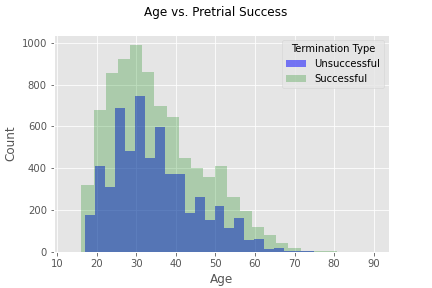
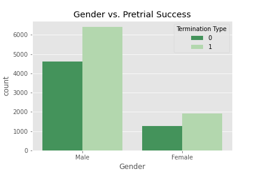
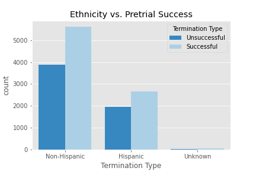
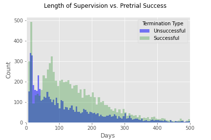

# Pretrial Services Success
Statistical analysis of Pretrial Services success rates

***

## Overview
Pretrial Services in Denver Colorado provides supervision for defendants ordered by the Court to supervised conditions of release. Defendants can be released successfully from pretrial supervision once their case is sentenced or dismissed, or if supervision is terminated due to compliance. Defendants can also be released unsuccessfully from pretrial supervision if they fail to appear (FTA) for Court or receive new charges while under pretrial supervision.

This project is to determine whether success rates vary by age, ethnicity, or length of supervision.

The data set is from my current employer, City and County of Denver, Department of Public Safety, Community Corrections, and represents all defendants released from pretrial services during calendar years 2018 and 2019.

***

## Hypotheses and Results

### Age  
<u>Hypothesis 1<u>
* $H_0$: Successful and unsuccessful groups do not vary by age. 
* $H_a$: Successful and unsuccessful groups do vary by age. 
$\alpha$=0.05 
Statistical test: Mann–Whitney U test 

<u>Result<u>
    
Fail to reject null hypothesis (p-value=0.6591)

### Gender
<u>Hypothesis 2 <u>
* $H_0$: Pretrial services success and gender are independent. 
* $H_a$: Pretrial services success and gender are not independent. 
$\alpha$ with Bonferroni Correction=0.025 (0.05/2) 
Statistical test: Chi-squared test  

<u>Result<u>

Fail to reject null hypothesis (p-value=0.0406)
    
Utilizing the Central Limit Theorem, I am additionally able to determine: 
* Sample Mean for Female success: 0.6 
95% confidence interval for the Female population mean: [0.58, 0.62] 
    
* Sample Mean for Male success: 0.58 
95% confidence interval for the Male population mean: [0.57, 0.59] 
    
### Ethnicity
<u>Hypothesis 3<u>
* $H_0$: Pretrial services success and ethnicity are independent. 
* $H_a$: Pretrial services success and ethnicity are not independent. 
$\alpha$ with Bonferroni Correction=0.0166 (0.05/3) alpha with Bonferroni Correction=0.025 (0.05/2)  
Statistical test: Chi-squared test 

    
    
<u>Result<u>

Fail to reject null hypothesis (p-value=0.168)
    
Utilizing the Central Limit Theorem, I am additionally able to determine: 
    
* Sample Mean for Hispanic success: 0.58 
95% confidence interval for the population mean: [0.56, 0.59] 
* Sample Mean for non-Hispanic success: 0.59 
95% confidence interval for the population mean: [0.58, 0.6] 
* Sample Mean for unknown success: 0.64 
95% confidence interval for the population mean: [0.49, 0.74] 
    
### Length of Supervision
<u>Hypothesis 4<u>
* $H_0$: Successful and unsuccessful groups do not vary by length of supervision. 
* $H_a$: Successful and unsuccessful groups do vary by length of supervision. 
$\alpha$ with Bonferroni Correction=0.0125 (0.05/4) 
Statistical test: Mann–Whitney U test 

    
    
    
<u>Result<u>
    
Reject null hypothesis (p-value=2.5334387817360213e-41)
    
***

## Results

***

## Future Analysis