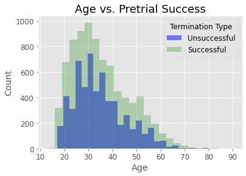

# Pretrial Services Success
Inferential statistical analysis of Pretrial Services success 

***

## Background and Motivation
Pretrial Services in Denver Colorado provides supervision for defendants ordered by the Court to supervised conditions of release. Defendants can be released successfully from pretrial supervision once their case is sentenced or dismissed, or if supervision is terminated due to compliance. Defendants can also be released unsuccessfully from pretrial supervision if they fail to appear (FTA) for Court or receive new charges while under pretrial supervision.

This project was completed to infer population means and determine whether success rates vary by age, ethnicity, or length of supervision, as Pretrial Services is committed to making decisions that are equitable and data informed.

The data set is confidential and is from my current employer, City and County of Denver, Department of Public Safety, Community Corrections.  The data set includes all defendants released from pretrial services during calendar years 2018 and 2019. 

***

## Exploratory Data Analysis
The data set includes information on length of supervision, level of supervision, supervision monitoring type, offense type, race, ethnicity, age, assessed risk category, primary offense, and termination reason.

Although I chose to complete hypothesis testing on age, gender, ethnicty, and length of supervision, in future analysis I would like to complete hypothesis testing on race, offense type, and assessed risk category.  

Below are some initial exploratory data analysis graphs of this data. 

***

## Hypotheses and Results 

I completed hypothesis testing on age, gender, ethnicity, and length of supervision.  I chose these categories in an effort to ensure equitable services are being delivered to those under pretrial supervision.  Each hypothesis test is contained below and the notebooks can be found here:

[Exploratory Data Analysis](EDA/exploratory_data_analysis.ipynb)

[Statistical Analysis](statistical_analysis.ipynb) 

***
### Age  
<u>Hypothesis 1<u>
* $H_0$: Successful and unsuccessful groups do not vary by age. 
* $H_a$: Successful and unsuccessful groups do vary by age. 
    * $\alpha$=0.05 
    * Statistical test: Mann–Whitney U test 
        * The Mann-Whitney U test tests whether observations in one sample tend to be larger than observations in a the other sample.

 

Result: Fail to reject null hypothesis (p-value=0.6591)
***
### Gender
<u>Hypothesis 2 <u>
* $H_0$: Pretrial services success and gender are independent. 
* $H_a$: Pretrial services success and gender are not independent. 
    * $\alpha$ with Bonferroni Correction=0.025 (0.05/2) 
    * Statistical test: Chi-Square Test of Independence  
        * The Chi-Square Test of Independence determines whether there is an association between categorical variables.

 

Result: Fail to reject null hypothesis (p-value=0.0406)
    
Utilizing the Central Limit Theorem, I am additionally able to determine: 
* Sample Mean for Female success: 0.6 
95% confidence interval for the Female population mean: [0.58, 0.62] 
    
* Sample Mean for Male success: 0.58 
95% confidence interval for the Male population mean: [0.57, 0.59] 
***
### Ethnicity
<u>Hypothesis 3<u>
* $H_0$: Pretrial services success and ethnicity are independent. 
* $H_a$: Pretrial services success and ethnicity are not independent. 
    * $\alpha$ with Bonferroni Correction=0.0166 (0.05/3) 
    * Statistical test: Chi-Square Test of Independence  
        * The Chi-Square Test of Independence determines whether there is an association between categorical variables.

 
    
    
Result: Fail to reject null hypothesis (p-value=0.168)
    
Utilizing the Central Limit Theorem, I am additionally able to determine: 
    
* Sample Mean for Hispanic success: 0.58 
95% confidence interval for the population mean: [0.56, 0.59] 
* Sample Mean for non-Hispanic success: 0.59 
95% confidence interval for the population mean: [0.58, 0.6] 
* Sample Mean for unknown success: 0.64 
95% confidence interval for the population mean: [0.49, 0.74] 
***  
### Length of Supervision
<u>Hypothesis 4<u>
* $H_0$: Successful and unsuccessful groups do not vary by length of supervision. 
* $H_a$: Successful and unsuccessful groups do vary by length of supervision. 
    * $\alpha$ with Bonferroni Correction=0.0125 (0.05/4) 
    * Statistical test: Mann–Whitney U test 
        * The Mann-Whitney U test tests whether observations in one sample tend to be larger than observations in a the other sample.
    

     
Result: Reject null hypothesis (p-value=2.5334387817360213e-41)
    
***

## Summary of Findings
The findings would suggest that equitable services are being provided by pretrial supervision in regards to age, gender and ethnicity.  Defendants that are terminated unsuccessfully from pretrial supervision spend less time under pretrial supervision.  In future analysis, I would like to determine at what stage do defendants most often fail (first appearance, plea, etc.) and whether there is an ideal length of supervision that would lead to increasing success rates.
***

## Future Analysis
Future analysis could include answering the following questions:
1. What stage are defendant most frequently terminated unsuccessfully by risk level?
2. Is there an amount of time engaged with Pretrial Services that leads to the majority of successes?
3. Perform hypothesis test on race, offense category, and risk level.